# Strategies

This document describes every strategy class loaded by the strategy loader in `src/stock_screener/strategies`. It reflects the current code logic (entry, stop, take profit, exit, and any special risk rules).

Images are generated from local cached OHLC data in `.cache` (real price history). Each strategy has a single annotated chart that shows the entry, exit, stop, TP (if any), and key levels/filters on both the price and indicator panels. If a strategy has no matching signal in the cache, the example is a fallback illustration and is labeled as such.

## Conventions And Engine Behaviors
- Data: all strategies expect OHLCV with a DatetimeIndex. Several strategies require daily bars and will skip intraday data.
- Default stop: if a strategy does not override `stop_loss_series`, the engine uses an ATR(14) stop. Long = low - ATR * stop_multiplier, short = high + ATR * stop_multiplier.
- Default take profit: if `take_profit_multiplier` is set, TP = entry +/- ATR(14) * multiplier. If it is None, there is no fixed TP unless the strategy provides custom targets.
- Exit signals: if a strategy implements `exit_signal` and `use_exit_signal` is true, that signal closes the position.
- Time stop, trailing, giveback, partials: these are optional engine features enabled by strategy attributes and are listed per strategy below.
- WATCH strategies: `sentiment = "WATCH"` means the class is intended as a watchlist/alert. If traded, default stops/TPs apply unless overridden.

## Common Strategy Parameters (BaseStrategy)
- **Defined in**: `src/stock_screener/core/strategy.py` (strategies override these as class attributes).
- **Usage**: the engine reads these fields when sizing, managing, and exiting positions. Strategy-specific parameters are listed under each strategy below.
```text
stop_multiplier (default: 2.0): ATR multiple for default stop placement.
take_profit_multiplier (default: None): ATR multiple for default TP when enabled.
time_stop_days (default: None): Max holding period before time-based exit.
use_stop_loss / use_take_profit / use_exit_signal / use_time_stop: enable/disable those exit paths.
trailing_enabled / trailing_start_r / trailing_use_ema20 / trailing_ema_length / trailing_atr_mult / trailing_method: trailing stop controls.
partial_take_profit_enabled / partial_take_profit_r / partial_take_profit_pct / partial_take_profit_mode: staged TP controls.
giveback_enabled / giveback_trigger_r / giveback_floor_r / giveback_min_days: giveback exit controls.
breakeven_r / breakeven_delay_bars: move stop to breakeven after R threshold.
early_failure_exit_enabled / early_failure_bars / early_failure_requires_close_below_entry: early failure exit controls.
momentum_fail_exit_enabled / momentum_fail_entry_rsi / momentum_fail_confirm_rsi / momentum_fail_confirm_bars: momentum-fail exit controls.
require_regime_stability / avoid_regime_flip / regime_flip_band_pct / regime_flip_slope_pct / allow_regime_bypass_large_gap: regime filters.
strategy_risk_mult / strategy_trade_size / strategy_max_position_pct: strategy-level sizing overrides.
addons_enabled / max_adds / add_size_pct_initial / add_min_peak_r / add_min_days_since_entry: add-on rules.
```

## Momentum Strategies (`src/stock_screener/strategies/momentum.py`)

### RsiOversold
- **Purpose**: Mean-reversion entry after sharp downside momentum in an uptrend.
- **Behavior And Rationale**: Oversold conditions inside a rising long-term trend often revert as dip buyers step in and short-term selling exhausts.
- **Entry**: RSI(14) < 30; if `require_sma200_trend` is true then close > SMA200 and SMA200 rising.
- **Stop loss**: ATR(14) * 2 below low (stop_multiplier = 2.0).
- **Take profit**: ATR(14) * 1.5 above entry (take_profit_multiplier = 1.5).
- **Exit**: RSI crosses above 50 OR close crosses above EMA20; time stop = 10 days.
- **Example data**: AAPL 1d (entry 2025-01-21, signal)
- **Strategy Parameters**:
```text
require_sma200_trend (default: true): Require SMA200 trend filter (price above + rising).
```
- **Image (example)**: 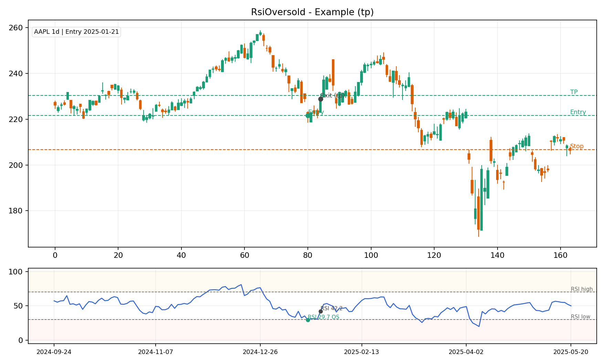

### Sma200RsiOversoldFib
- **Purpose**: Mean-reversion pullback strategy targeting fib retracements after deep oversold moves.
- **Behavior And Rationale**: Large deviations below SMA200 and RSI extremes often rebound toward prior swing levels; fib levels structure partial exits.
- **Entry**: close < SMA200; distance from SMA200 >= `sma_distance_min_pct` (7% default); volume > SMA20(volume); RSI trigger is a cross up through 25 or the first day RSI <= 25 after being > 25 (`require_rsi_cross = True`). Optional regime filter `MKT_RISK_ON_MEAN_REVERSION` when enabled.
- **Stop loss**: structure stop = rolling 60-bar low - ATR(14) * 0.25, percent stop = entry * (1 - 0.04); stop is the max of those two. Stop cooldown = 15 days after a stop.
- **Take profit**: staged fib targets from the 60-bar swing low to swing high at 0.618, 0.786, 1.0 with per-level pct = 0.5 (remaining mode).
- **Exit**: RSI >= 70 OR close >= SMA200 * (1 - 0.02). Extra exits: early failure within 5 bars if close falls below entry; momentum fail after 3 bars if entry RSI < 30 and current RSI < 35; stop tightening only allowed when ATR contracts below 0.8x entry ATR.
- **Example data**: AAPL 1d (entry 2025-04-09, signal)
- **Strategy Parameters**:
```text
debug_counters (default: true): Enable internal counter logging for strategy diagnostics.
fib_level_pcts (default: 0.5): Position percentage per fib target (scalar or list).
fib_levels (default: [0.618, 0.786, 1.0]): Fib levels used to compute staged targets.
fib_lookback (default: 60): Lookback window for swing high/low when building fib targets.
fib_min_range_pct (default: 0.0): Minimum swing range (percent) required to enable fib targets.
percent_stop_pct (default: 0.04): Hard percent stop distance from entry.
regime_filter_column (default: 'MKT_RISK_ON_MEAN_REVERSION'): Boolean column used as regime filter.
require_regime_filter (default: false): Require regime filter to be true for entries.
require_rsi_cross (default: true): Require RSI cross through the oversold level.
rsi_length (default: 14): RSI lookback length.
rsi_overbought (default: 70.0): RSI overbought threshold.
rsi_oversold (default: 25.0): RSI oversold threshold.
sma_distance_min_pct (default: 0.07): Minimum distance from SMA (percent) to qualify entry.
sma_exit_buffer_pct (default: 0.02): Exit buffer below SMA200 (percent).
sma_length (default: 200): SMA length used for filters.
structure_stop_atr_mult (default: 0.25): ATR multiple for structure stop below swing low.
volume_sma_length (default: 20): Volume SMA length used for volume filters.
```
- **Image (example)**: 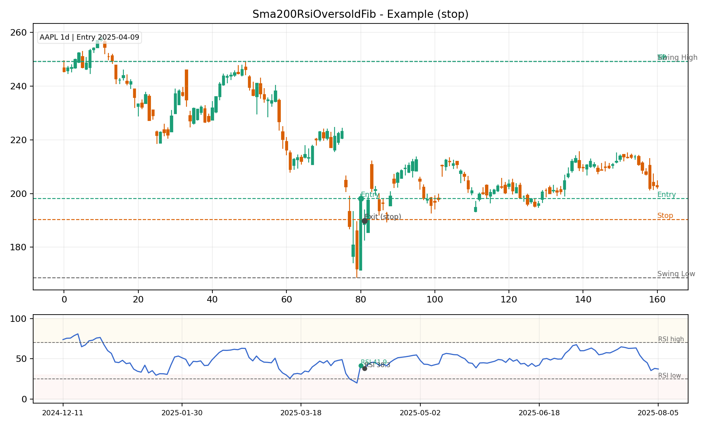

### MacdTurnaround
- **Purpose**: Momentum shift long entry inside an uptrend.
- **Behavior And Rationale**: A rising MACD histogram while below zero signals fading downside momentum; in an uptrend this often precedes continuation.
- **Entry**: close > SMA50 and SMA50 rising; MACD histogram ticks up while below zero OR histogram crosses above zero.
- **Stop loss**: ATR(14) * 2 below low.
- **Take profit**: ATR(14) * 3 above entry.
- **Exit**: MACD histogram crosses below zero OR close crosses below EMA20.
- **Example data**: AAPL 1d (entry 2025-12-23, signal)
- **Strategy Parameters**: none (uses common parameters only).
- **Image (example)**: 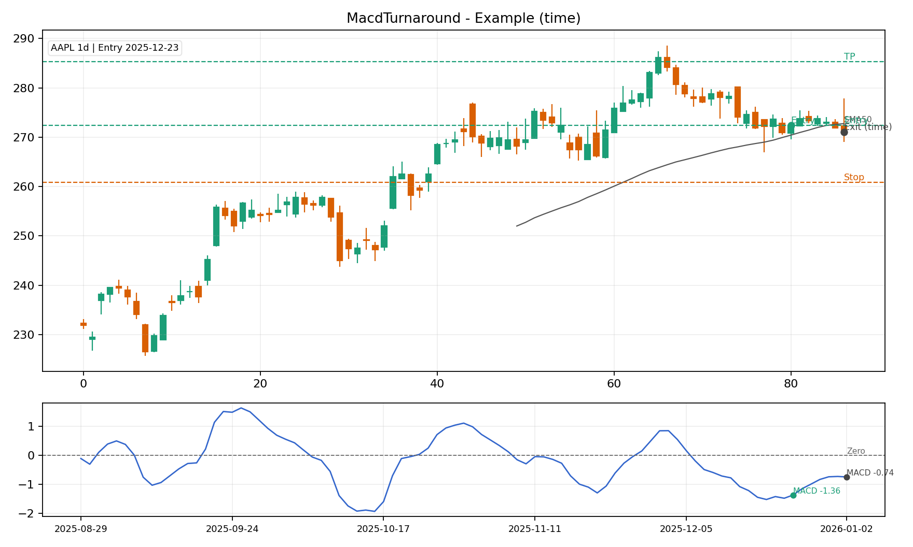

### VptBreakout
- **Purpose**: Momentum breakout with volume confirmation.
- **Behavior And Rationale**: Large up bars on heavy volume and strong close location often indicate institutional accumulation and trend continuation.
- **Entry**: close up > 2% vs prior close; volume > 2.5x 20-day avg; close location >= 0.7; close > EMA50 and EMA50 rising.
- **Stop loss**: ATR(14) * 2 below low.
- **Take profit**: ATR(14) * 4 above entry.
- **Exit**: close crosses below EMA20.
- **Example data**: AAPL 1d (entry 2025-09-19, signal)
- **Strategy Parameters**: none (uses common parameters only).
- **Image (example)**: 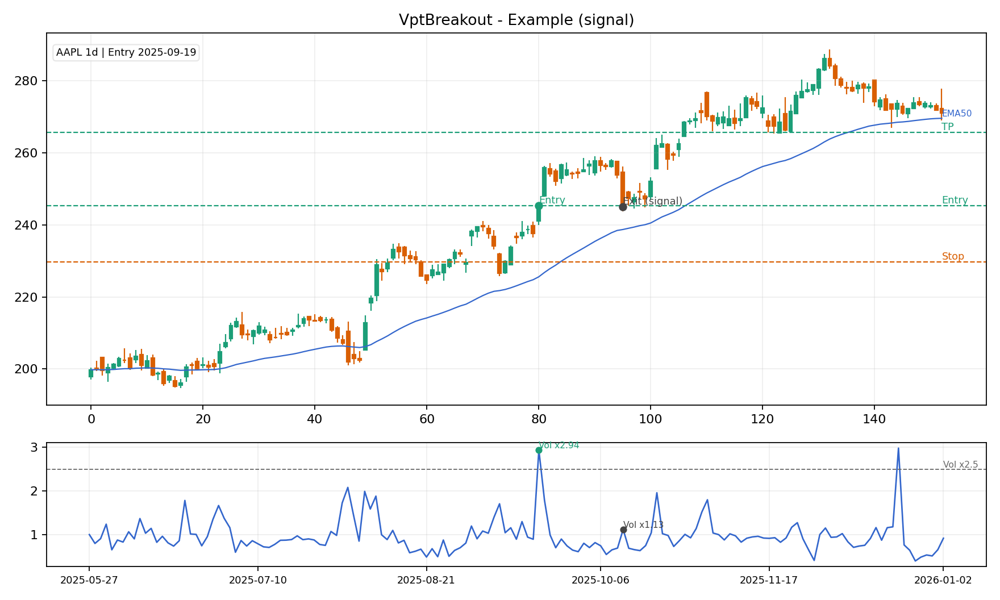

### BearishRsiDivergence
- **Purpose**: Short setup on momentum divergence after a higher high.
- **Behavior And Rationale**: When price makes new highs but RSI does not, momentum is fading and reversals are more likely in a downtrend context.
- **Entry**: 14-bar divergence where price makes a higher high but RSI makes a lower high; prior RSI peak > 65; confirmation bar has lower close and lower low; trend filter requires close < SMA200 and SMA20 falling.
- **Stop loss**: ATR(14) * 2 above high (short).
- **Take profit**: ATR(14) * 2 below entry (take_profit_multiplier = 2.0).
- **Exit**: no exit_signal; time_stop disabled (inf).
- **Example data**: AEE 1d (entry 2024-04-26, signal)
- **Strategy Parameters**: none (uses common parameters only).
- **Image (example)**: 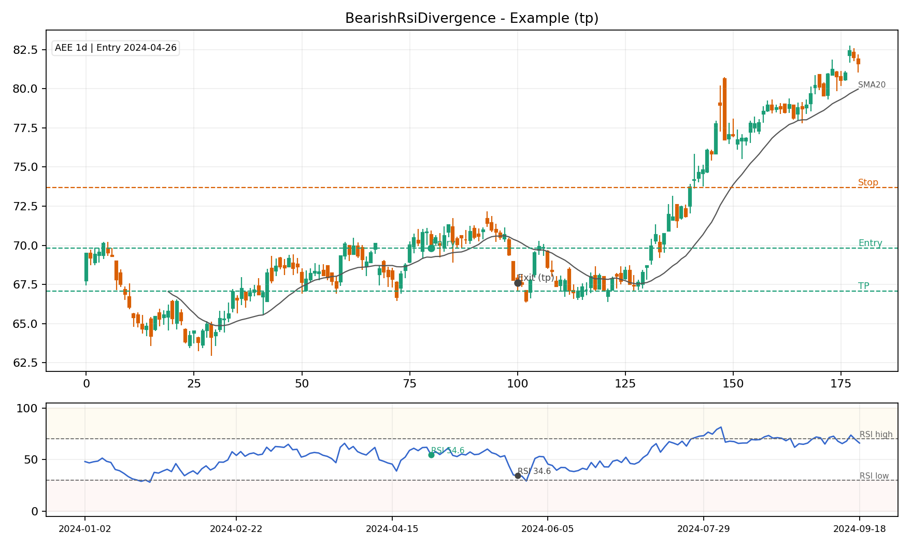

## Bearish Strategies (`src/stock_screener/strategies/bearish.py`)
### RsiOverbought
- **Purpose**: Short entry after overbought momentum in a downtrend.
- **Behavior And Rationale**: Overbought readings in falling trends often mean mean-reversion back down as buyers fade.
- **Entry**: RSI > 70 and turning down; close < SMA200 and SMA50, both falling.
- **Stop loss**: ATR(14) * 2 above high (short).
- **Take profit**: ATR(14) * 1.5 below entry.
- **Exit**: RSI crosses below 50; time stop = 8 days.
- **Example data**: SPY 1d (entry 2025-10-08, fallback)
- **Strategy Parameters**: none (uses common parameters only).
- **Image (example)**: 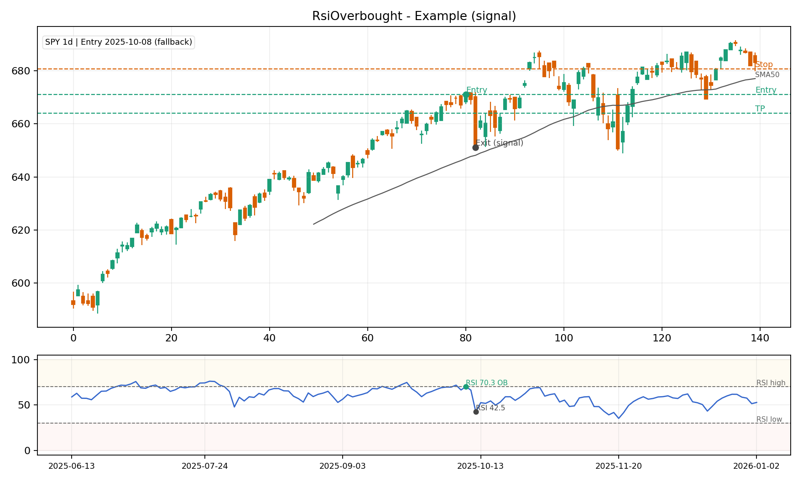

### MacdBearishCross
- **Purpose**: Bearish momentum shift short entry.
- **Behavior And Rationale**: MACD histogram crossing below zero often marks a trend shift or continuation in weak markets.
- **Entry**: MACD histogram crosses below zero; close < SMA200 and SMA50, both falling.
- **Stop loss**: ATR(14) * 2 above high.
- **Take profit**: ATR(14) * 2.5 below entry.
- **Exit**: MACD histogram crosses above zero OR close crosses above EMA20.
- **Example data**: AAPL 1d (entry 2025-06-11, signal)
- **Strategy Parameters**: none (uses common parameters only).
- **Image (example)**: 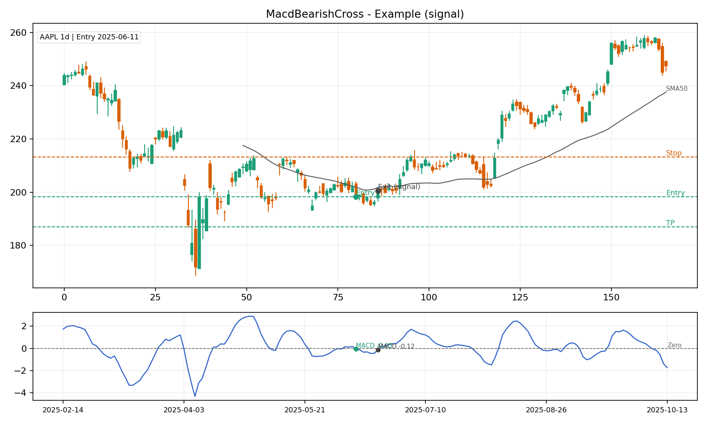

### Breakdown20
- **Purpose**: Downside breakout after support failure with volume confirmation.
- **Behavior And Rationale**: Breaking 20-day lows with strong volume and downtrend context often leads to continuation.
- **Entry**: close < prior 20-day low; SMA20 falling; close < SMA50 falling; volume > 1.2x average volume.
- **Stop loss**: ATR(14) * 2 above high.
- **Take profit**: ATR(14) * 2.5 below entry.
- **Exit**: close crosses above SMA20; time stop = 12 days.
- **Example data**: AAPL 1d (entry 1986-09-12, signal)
- **Strategy Parameters**: none (uses common parameters only).
- **Image (example)**: 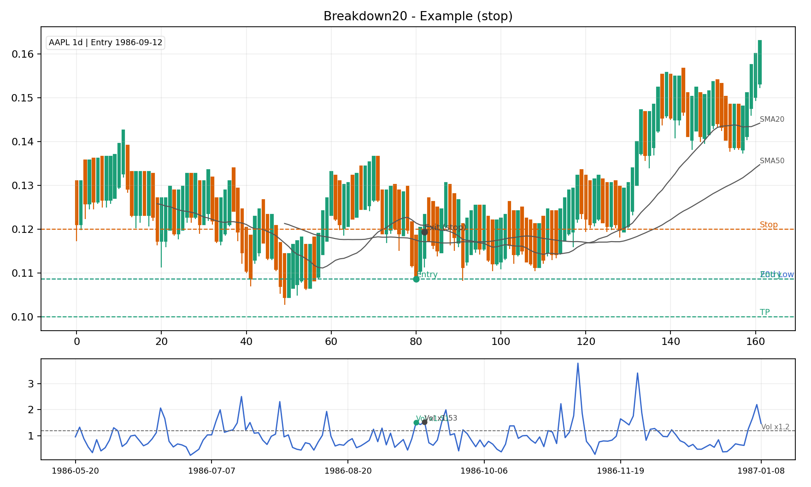

### VtxBreakdown
- **Purpose**: Volatility expansion breakdown strategy for risk-off regimes.
- **Behavior And Rationale**: In high-volatility, risk-off regimes, breakouts below support tend to trend as liquidation cascades unfold.
- **Entry**: close < SMA200 * (1 - 0.02); ATR20 expanding vs 5 bars; close < prior 20-day low * (1 - 0.05); regime filter requires NOT `MKT_RISK_ON_MEAN_REVERSION` (inverted).
- **Stop loss**: high + ATR20 * 2 (short).
- **Take profit**: fib extensions below swing low for the last 60 bars (levels 0.236, 0.382, 0.5; remaining mode). Partial TP: 50% at +1R.
- **Exit**: exit on regime flip (risk-on true) or `MKT_VOL_OK` = true; trailing stop enabled (EMA20 with ATR*1, min method) starting at 1R.
- **Example data**: AAPL 1d (entry 2025-04-04, signal)
- **Strategy Parameters**:
```text
atr_expand_lookback (default: 5): Bars used to require ATR expansion (current ATR > ATR[lookback]).
atr_length (default: 20): ATR length (bars) for volatility expansion checks.
breakdown_buffer_pct (default: 0.05): Percent below the prior low required to confirm breakdown.
breakdown_lookback (default: 20): Lookback window for the prior low used in breakdown checks.
exit_on_regime_flip (default: true): Exit if the regime filter flips off.
exit_on_vol_collapse (default: true): Exit if the volatility-collapse column is true.
fib_level_pcts (default: 0.5): Position percentage per fib target (scalar or list).
fib_levels (default: [0.236, 0.382, 0.5]): Fib levels used to compute staged targets.
fib_lookback (default: 60): Lookback window for swing high/low when building fib targets.
fib_min_range_pct (default: 0.0): Minimum swing range (percent) required to enable fib targets.
fib_take_profit_enabled (default: true): Enable fib-based take-profit targets.
regime_filter_column (default: 'MKT_RISK_ON_MEAN_REVERSION'): Boolean column used as regime filter.
regime_filter_invert (default: true): Invert the regime filter column (risk-off).
require_regime_filter (default: true): Require regime filter to be true for entries.
sma_entry_buffer_pct (default: 0.02): Percent buffer below SMA200 required for entry.
sma_length (default: 200): SMA length used for filters.
vol_collapse_column (default: 'MKT_VOL_OK'): Boolean column used to detect volatility collapse.
```
- **Image (example)**: 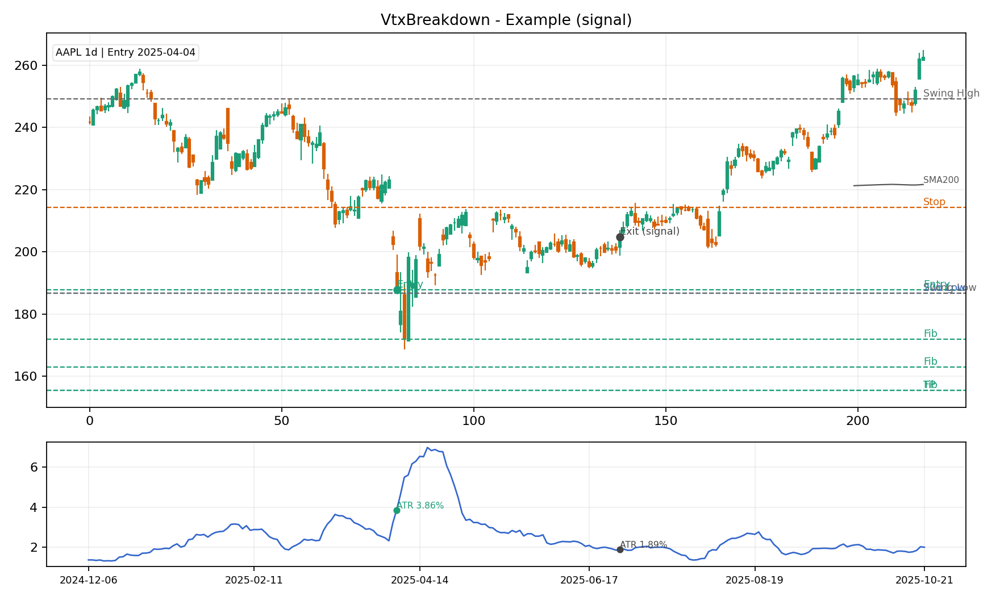

## ORB Strategies (`src/stock_screener/strategies/orb.py`)
### Orb15BreakoutLong
- **Purpose**: Opening range breakout long during the high-liquidity open.
- **Behavior And Rationale**: Early session imbalances often drive directional moves; ORB isolates that burst and trades the breakout.
- **Entry**: 5-minute close > ORB high; ORB window 09:30-09:45 with entries 09:45 to <11:00; range must be between `orb_min_range_points` and `orb_max_range_points` (or ATR-capped via `orb_max_range_atr_pct`); optional regime gating via ATR expansion / risk-on / trend gates.
- **Stop loss**: ORB low.
- **Take profit**: fixed R multiple (`tp_r_multiple`, default 2.0).
- **Exit**: stop or TP; daily trade state enforces max trades/day; optional commission-aware breakeven/exit-cutoff adjustments via `tp_management`.
- **Example data**: ADBE 5m (entry 2025-12-12, signal)
- **Strategy Parameters**:
```text
debug_allocation (default: false): Enable allocation debug logging for this strategy.
debug_orb (default: false): Enable ORB debug logging and range stats.
entry_cutoff_time (default: '11:00'): Latest time of day to allow new ORB entries.
index_timezone (default: None): Timezone of the source index before conversion to session timezone.
orb_allow_flip_on_stop (default: true): Allow a single flip trade only after a stop loss.
exit_cutoff_time (default: None): Exit on the first bar at/after this local time (requires use_exit_signal=true).
orb_exit_time (default: None): Alias for exit_cutoff_time.
orb_end_time (default: '09:45'): ORB range end time (session local time).
orb_max_range_points (default: 15.0): Maximum ORB range (points) allowed.
orb_max_trades_per_day (default: 2): Max trades per day within the ORB trade group.
orb_min_range_points (default: 5.0): Minimum ORB range (points) required.
orb_max_range_atr_pct (default: None): If set, use ATR(15m) * pct as dynamic max range (fallback to orb_max_range_points).
orb_range (default: None): Optional dict with orb_min_range_points/orb_max_range_points/orb_max_range_atr_pct overrides.
orb_start_time (default: '09:30'): ORB range start time (session local time).
orb_trade_group (default: 'ORB15'): Trade group key used to enforce daily ORB limits.
session_timezone (default: 'America/New_York'): Session timezone used for intraday filters.
market_symbols (default: ['QQQ', 'UVXY']): Extra symbols used to build market context columns.
regime_gating (default: None): Dict controlling ATR/risk-on/trend entry gates (mode OR/AND, per-gate enabled).
trade_count (default: None): Dict that gates 2nd trade by first trade peak/exit R and trend gate.
tp_management (default: None): Dict for commission-aware breakeven trigger/delay/buffer and exit-cutoff shifts.
skip_dates (default: []): Explicit list of dates to skip entries.
skip_events_enabled (default: true): Enable skipping dates found in skip events file.
skip_events_file (default: 'data/news_days.csv'): CSV path of event dates to skip.
skip_events_types (default: None): Optional subset of event types to skip.
tp_r_multiple (default: 2.0): Take-profit target in R multiples for ORB.
```
- **Image (example)**: 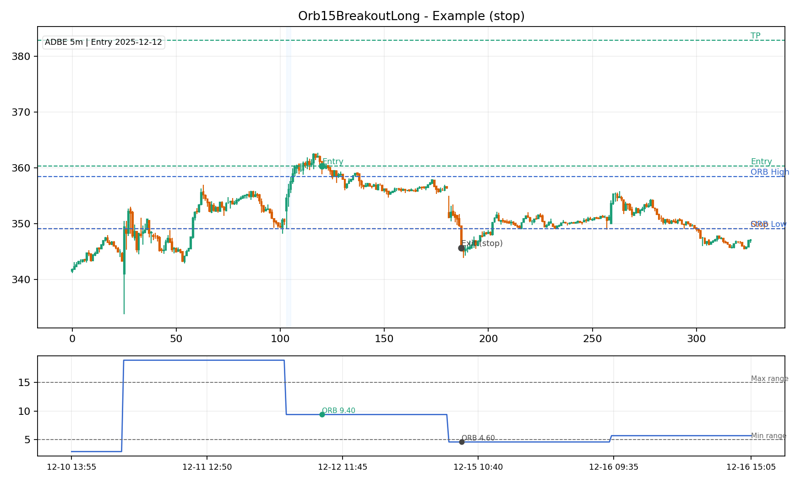

### Orb15BreakoutShort
- **Purpose**: Opening range breakdown short during the high-liquidity open.
- **Behavior And Rationale**: Breakdowns below the opening range can signal early trend continuation and directional order flow.
- **Entry**: 5-minute close < ORB low; same ORB window, entry cutoff, ATR cap, and regime gating as long.
- **Stop loss**: ORB high.
- **Take profit**: fixed R multiple (`tp_r_multiple`, default 2.0).
- **Exit**: stop or TP; daily trade state enforces max trades/day; optional commission-aware breakeven/exit-cutoff adjustments via `tp_management`.
- **Example data**: AAPL 5m (entry 2025-12-15, signal)
- **Strategy Parameters**:
```text
debug_allocation (default: false): Enable allocation debug logging for this strategy.
debug_orb (default: false): Enable ORB debug logging and range stats.
entry_cutoff_time (default: '11:00'): Latest time of day to allow new ORB entries.
index_timezone (default: None): Timezone of the source index before conversion to session timezone.
orb_allow_flip_on_stop (default: true): Allow a single flip trade only after a stop loss.
orb_end_time (default: '09:45'): ORB range end time (session local time).
orb_max_range_points (default: 15.0): Maximum ORB range (points) allowed.
orb_max_trades_per_day (default: 2): Max trades per day within the ORB trade group.
orb_min_range_points (default: 5.0): Minimum ORB range (points) required.
orb_max_range_atr_pct (default: None): If set, use ATR(15m) * pct as dynamic max range (fallback to orb_max_range_points).
orb_range (default: None): Optional dict with orb_min_range_points/orb_max_range_points/orb_max_range_atr_pct overrides.
orb_start_time (default: '09:30'): ORB range start time (session local time).
orb_trade_group (default: 'ORB15'): Trade group key used to enforce daily ORB limits.
session_timezone (default: 'America/New_York'): Session timezone used for intraday filters.
market_symbols (default: ['QQQ', 'UVXY']): Extra symbols used to build market context columns.
regime_gating (default: None): Dict controlling ATR/risk-on/trend entry gates (mode OR/AND, per-gate enabled).
trade_count (default: None): Dict that gates 2nd trade by first trade peak/exit R and trend gate.
tp_management (default: None): Dict for commission-aware breakeven trigger/delay/buffer and exit-cutoff shifts.
skip_dates (default: []): Explicit list of dates to skip entries.
skip_events_enabled (default: true): Enable skipping dates found in skip events file.
skip_events_file (default: 'data/news_days.csv'): CSV path of event dates to skip.
skip_events_types (default: None): Optional subset of event types to skip.
tp_r_multiple (default: 2.0): Take-profit target in R multiples for ORB.
```
- **Image (example)**: 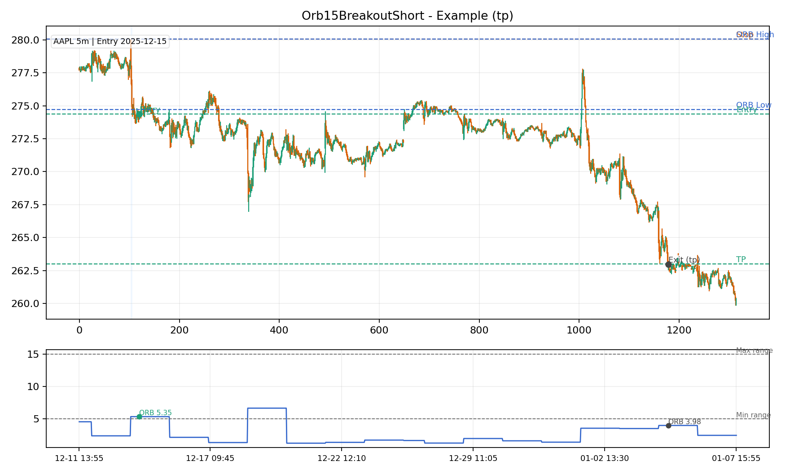

## Pattern Strategies (`src/stock_screener/strategies/pattern.py`)
### BullishEngulfing
- **Purpose**: Single-candle reversal pattern with trend filter.
- **Behavior And Rationale**: A bullish engulfing candle shows aggressive buying after a down candle, often marking short-term reversals in uptrends.
- **Entry**: previous candle red; current candle green; current body engulfs previous body; optional SMA50 trend filter (close > SMA50 and SMA50 rising).
- **Stop loss**: ATR(14) * 2 below low.
- **Take profit**: ATR(14) * 2 above entry.
- **Exit**: no exit_signal; time stop = 10 days.
- **Example data**: AAPL 1d (entry 2025-12-19, signal)
- **Strategy Parameters**:
```text
require_sma50_trend (default: true): Require SMA50 trend filter (price above + rising).
```
- **Image (example)**: 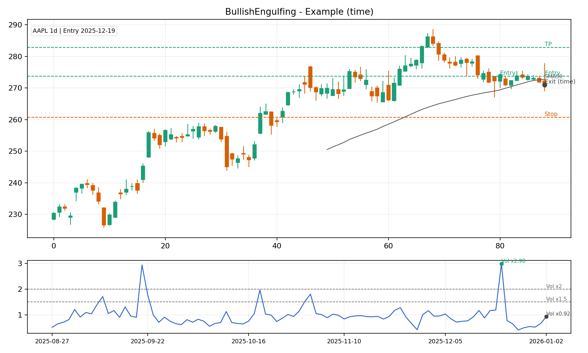

### VolumeSpike
- **Purpose**: Detects unusually strong volume with bullish price action.
- **Behavior And Rationale**: Large volume spikes with strong closes often indicate institutional accumulation and follow-through.
- **Entry**: close > open; volume >= 3x 20-day avg; close location >= 0.7; close > SMA50 and SMA50 rising.
- **Stop loss**: ATR(14) * 2 below low.
- **Take profit**: ATR(14) * 3 above entry.
- **Exit**: no exit_signal.
- **Example data**: AAPL 1d (entry 2025-12-19, signal)
- **Strategy Parameters**: none (uses common parameters only).
- **Image (example)**: 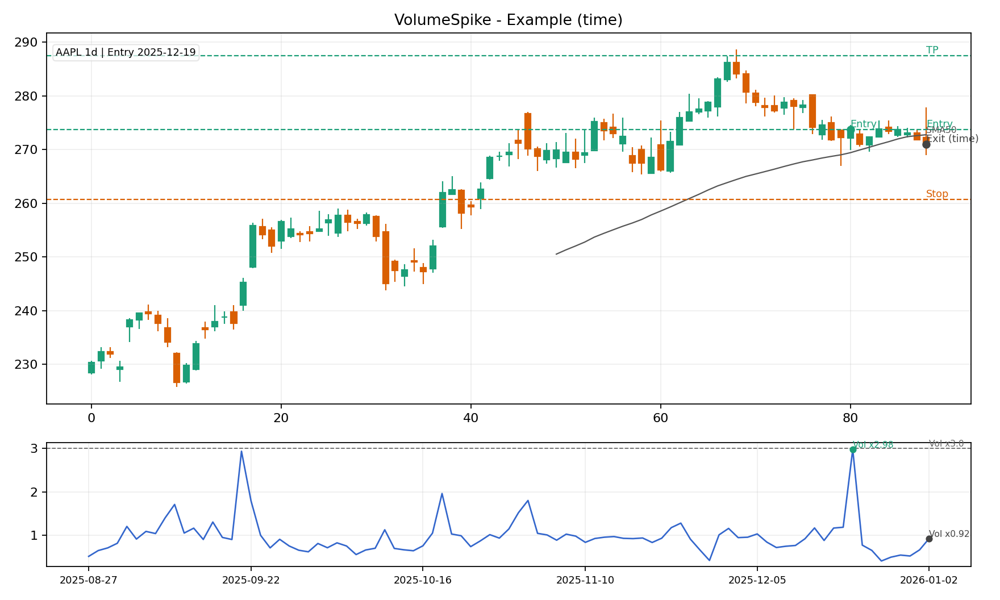

## Volatility Strategies (`src/stock_screener/strategies/volatility.py`)
### BollingerSqueeze
- **Purpose**: Detects volatility compression for potential breakouts.
- **Behavior And Rationale**: Low Bollinger bandwidth regimes often precede large price expansions as volatility mean-reverts.
- **Entry**: Bollinger bandwidth <= 1.05 * rolling 125-bar minimum; provides upper/lower band breakout levels. Sentiment = WATCH.
- **Stop loss**: not defined; if traded, default ATR(14) stop (2x).
- **Take profit**: none.
- **Exit**: none.
- **Example data**: SPY 1d (entry 2026-01-02, fallback)
- **Strategy Parameters**: none (uses common parameters only).
- **Image (example)**: 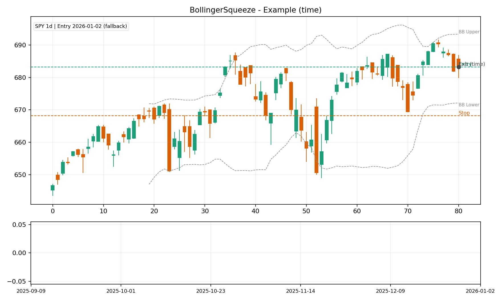

### Nr4Nr7
- **Purpose**: Deprecated placeholder for narrow-range scanning.
- **Behavior And Rationale**: NR4/NR7 patterns are volatility compression cues, but this base class is not active.
- **Entry**: none (signal always False). Sentiment = WATCH.
- **Stop loss**: none (not a tradable setup).
- **Take profit**: none.
- **Exit**: none.
- **Example data**: SPY 1d (entry 2026-01-02, fallback)
- **Strategy Parameters**: none (uses common parameters only).
- **Image (example)**: 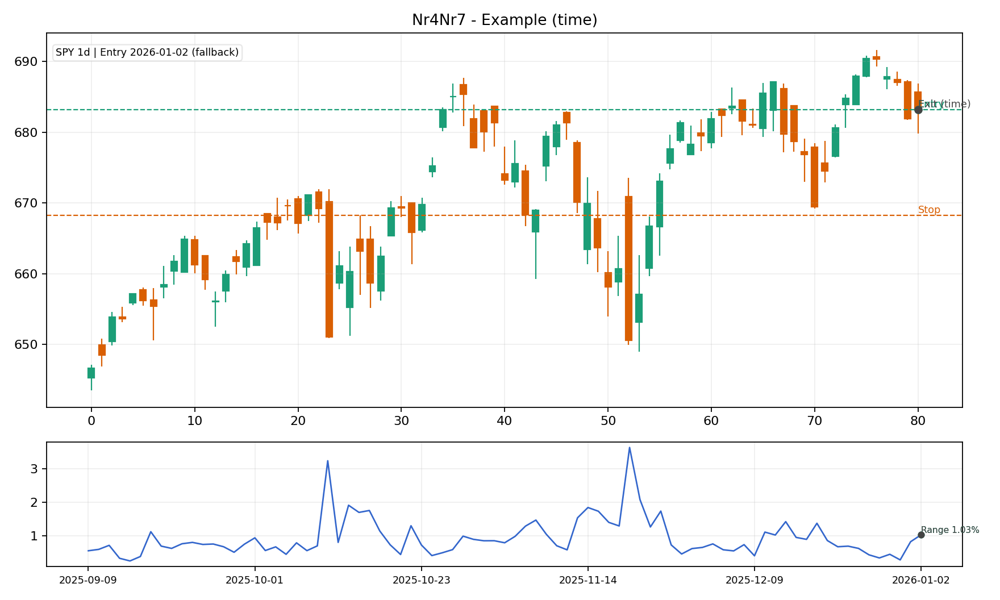

### Nr4Nr7Intraday
- **Purpose**: Intraday narrow-range setup for breakout preparation.
- **Behavior And Rationale**: Very small intraday ranges indicate compression; breakouts often follow.
- **Entry**: intraday bars only (< 720 minutes). Current bar is NR4 or NR7 with range% >= 0.15%. Scoring includes daily NR7 bias, EMA20/EMA50 trend, and volume contraction; breakout levels are current high/low.
- **Stop loss**: not defined; if traded, default ATR(14) stop.
- **Take profit**: none.
- **Exit**: none.
- **Example data**: AAPL 5m (entry 2026-01-07, signal)
- **Strategy Parameters**: none (uses common parameters only).
- **Image (example)**: 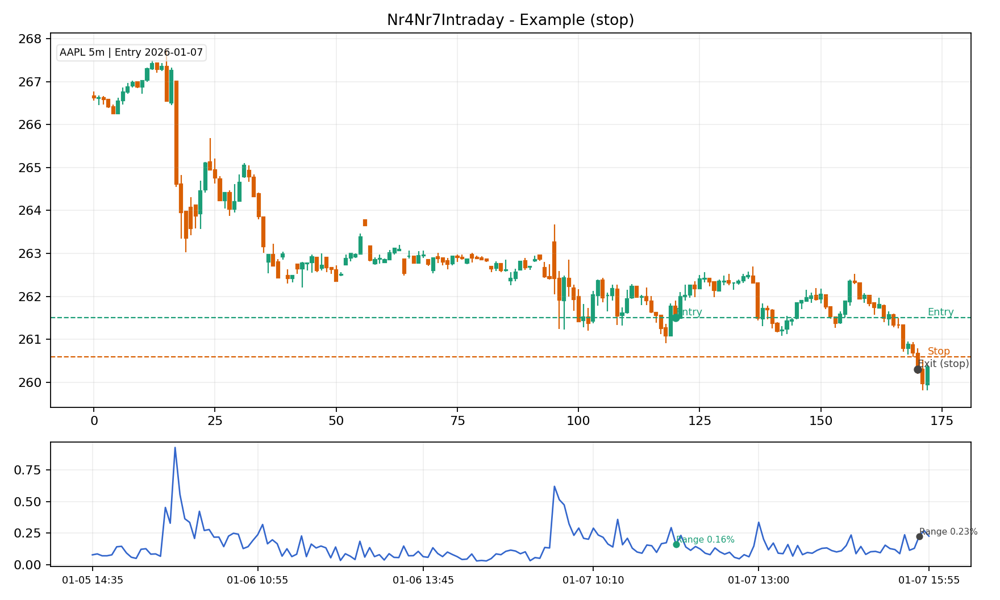

### Nr4Nr7Daily
- **Purpose**: Daily narrow-range setup for breakout preparation.
- **Behavior And Rationale**: NR4/NR7 daily ranges often precede volatility expansion, especially in trend-aligned markets.
- **Entry**: daily bars only. Current bar is NR4 or NR7 with range% >= 0.8%. Provides breakout levels and EMA20/EMA50 trend alignment.
- **Stop loss**: not defined; if traded, default ATR(14) stop.
- **Take profit**: none.
- **Exit**: none.
- **Example data**: AAPL 1d (entry 2025-12-26, signal)
- **Strategy Parameters**: none (uses common parameters only).
- **Image (example)**: 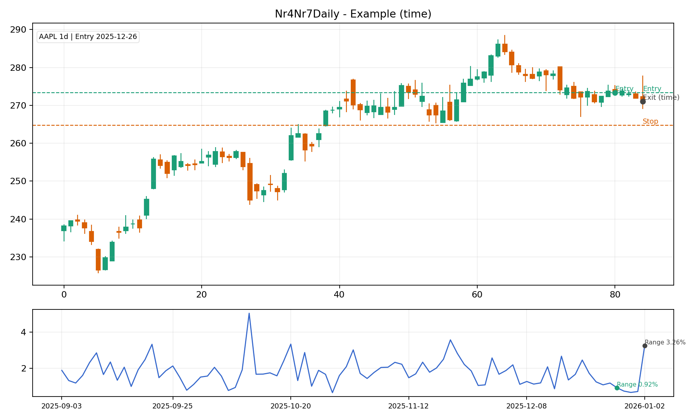

## Gap Strategies (`src/stock_screener/strategies/gaps.py`)
### GapUpContinuation
- **Purpose**: Trend continuation after strong gap up with volume confirmation.
- **Behavior And Rationale**: Large repricing gaps with strong closes often reflect institutional buying and can continue for several days.
- **Entry**: daily bars only. Gap up open vs prior close with either mid-gap (2.5% to 4%) and volume ratio >= 1.8 with close_loc >= 0.85, or large-gap (4% to 9%) with volume ratio >= 2.2 and close_loc >= 0.90 plus day range > 1.2 * ATR. Trend filter: EMA20 > EMA50 and EMA50 rising. Excludes too-extended opens and chase candles.
- **Stop loss**: dynamic. In `tightest` mode, stop = max of day low, ATR stop (close - 1.5 ATR), and EMA20 trail (EMA20 - 0.5 ATR), with a tight initial stop at entry low and max initial risk 4%. In `structure_first` mode, initial stop at entry low or ATR, then switches to EMA20 trail after day1 confirm or 0.75R; max initial risk capped at 4%.
- **Take profit**: ATR(14) * 3 above entry.
- **Exit**: day1 close below gap low; day2 no higher high; large-gap follow-through failure; giveback exit (trigger 2R, floor 1R, min 2 days); time stop = 5 days.
- **Example data**: ADI 1d (entry 2025-08-20, signal)
- **Strategy Parameters**:
```text
exit_on_d1_close_below_gap_low (default: true): Exit if day-1 close is below gap low (long gaps).
exit_on_d2_no_higher_high (default: true): Exit if day-2 fails to make a higher high (long gaps).
large_gap_follow_through (default: true): Require follow-through after large gaps; else exit.
max_initial_r_pct (default: 0.04): Max initial risk as percent of entry price for gaps.
stop_mode (default: 'structure_first'): Stop selection mode (e.g., tightest, atr_first, structure_first).
tight_stop_bars (default: 2): Number of early bars using the tight stop.
```
- **Image (example)**: 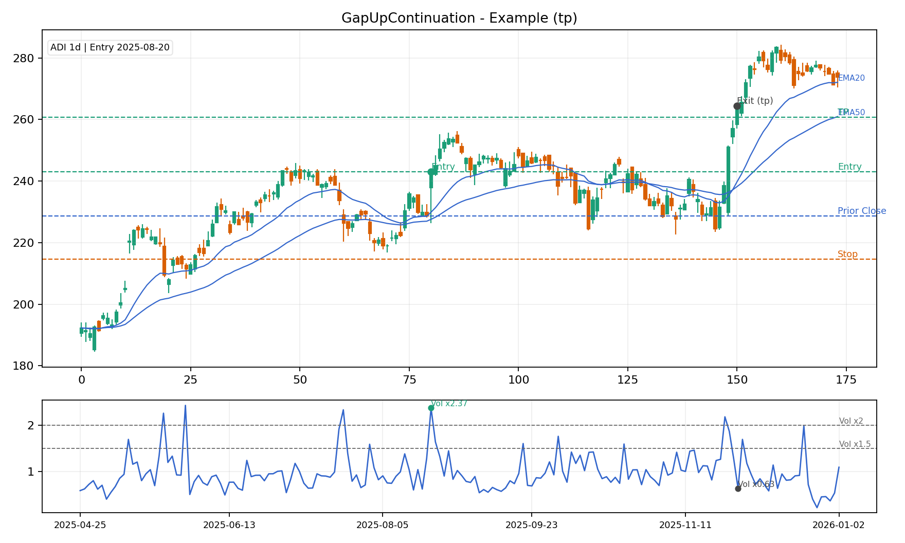

### GapDownContinuation
- **Purpose**: Trend continuation after strong gap down with volume confirmation.
- **Behavior And Rationale**: Large downside gaps with weak closes often signal capitulation and continuation lower.
- **Entry**: daily bars only. Gap down open vs prior close with mid-gap or large-gap thresholds (mirrored), volume ratio >= 1.8/2.2, and weak close (close_loc low). Trend filter: EMA20 < EMA50 and EMA50 falling. Excludes too-extended opens and chase candles.
- **Stop loss**: dynamic. In `tightest` mode, stop = min of day high, ATR stop (close + 1.5 ATR), and EMA20 trail (EMA20 + 0.5 ATR), with tight initial stop at entry high and max initial risk 4%. In `structure_first` mode, initial stop at entry high or ATR, then switches to EMA20 trail after day1 confirm or 0.75R; max initial risk capped at 4%.
- **Take profit**: ATR(14) * 3 below entry.
- **Exit**: day1 close above gap high; day2 no lower low; large-gap follow-through failure; giveback exit (trigger 2R, floor 1R, min 2 days); time stop = 5 days.
- **Example data**: AKAM 1d (entry 2025-05-09, signal)
- **Strategy Parameters**:
```text
exit_on_d1_close_above_gap_high (default: true): Exit if day-1 close is above gap high (short gaps).
exit_on_d2_no_lower_low (default: true): Exit if day-2 fails to make a lower low (short gaps).
large_gap_follow_through (default: true): Require follow-through after large gaps; else exit.
max_initial_r_pct (default: 0.04): Max initial risk as percent of entry price for gaps.
stop_mode (default: 'structure_first'): Stop selection mode (e.g., tightest, atr_first, structure_first).
tight_stop_bars (default: 2): Number of early bars using the tight stop.
```
- **Image (example)**: 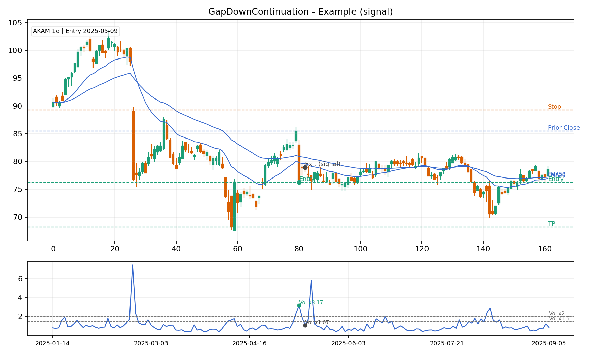

### GapUpFade
- **Purpose**: Fade an overextended gap up with weak close.
- **Behavior And Rationale**: Large gaps that fail to hold strength often mean late buyers are trapped, leading to quick mean reversion.
- **Entry**: daily bars only. Gap up >= 4%, volume >= 1.5x, weak close (close_loc <= 0.3).
- **Stop loss**: ATR(14) * 2 above high (short).
- **Take profit**: ATR(14) * 2 below entry.
- **Exit**: no exit_signal; time stop = 5 days.
- **Example data**: AAPL 1d (entry 2025-01-31, signal)
- **Strategy Parameters**: none (uses common parameters only).
- **Image (example)**: 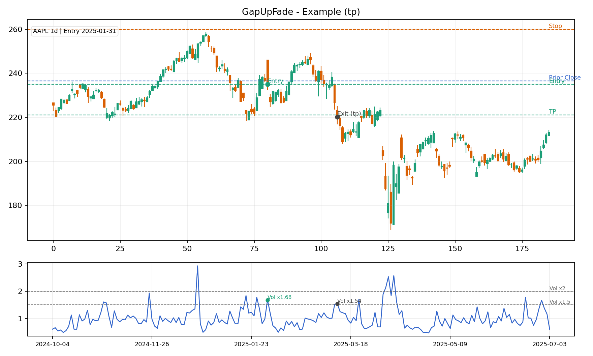

### GapDownFade
- **Purpose**: Fade an overextended gap down with strong close.
- **Behavior And Rationale**: Large downside gaps that reverse with strong closes often mean sellers are exhausted.
- **Entry**: daily bars only. Gap down <= -4%, volume >= 1.5x, strong close (close_loc >= 0.7).
- **Stop loss**: ATR(14) * 2 below low (long).
- **Take profit**: ATR(14) * 2 above entry.
- **Exit**: no exit_signal; time stop = 5 days.
- **Example data**: AAPL 1d (entry 2024-08-05, signal)
- **Strategy Parameters**: none (uses common parameters only).
- **Image (example)**: 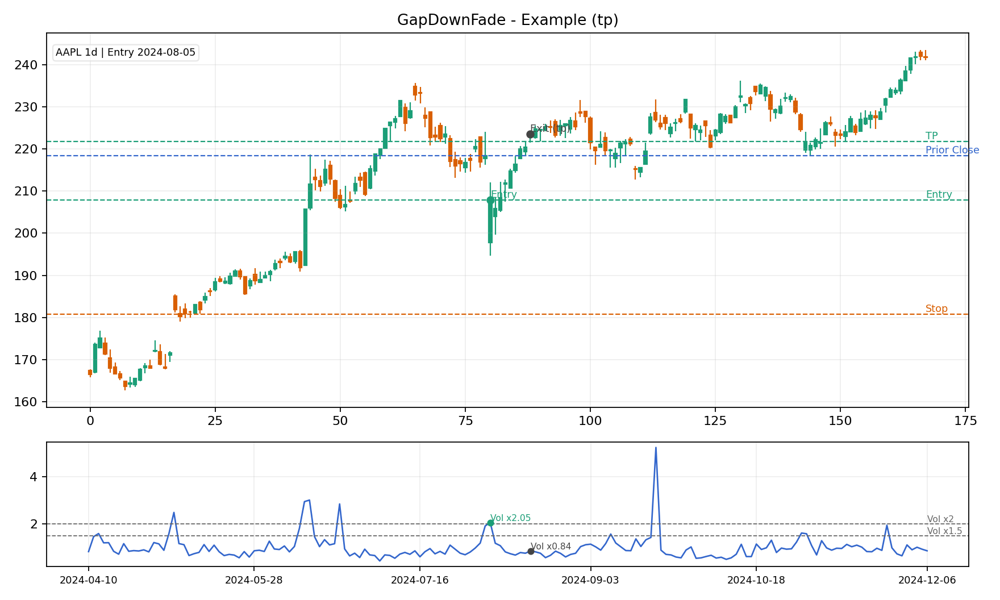

## Trend Strategies (`src/stock_screener/strategies/trend.py`)
### GoldenCross
- **Purpose**: Long-term trend shift signal.
- **Behavior And Rationale**: SMA50 crossing above SMA200 often marks a regime change into a sustained uptrend.
- **Entry**: SMA50 crosses above SMA200 (current SMA50 > SMA200 and prior SMA50 <= SMA200).
- **Stop loss**: SMA50 line via `stop_loss_series`; ATR stop is used as fallback when needed.
- **Take profit**: none (take_profit_multiplier is None).
- **Exit**: no exit_signal.
- **Example data**: AAPL 1d (entry 2025-09-15, signal)
- **Strategy Parameters**: none (uses common parameters only).
- **Image (example)**: 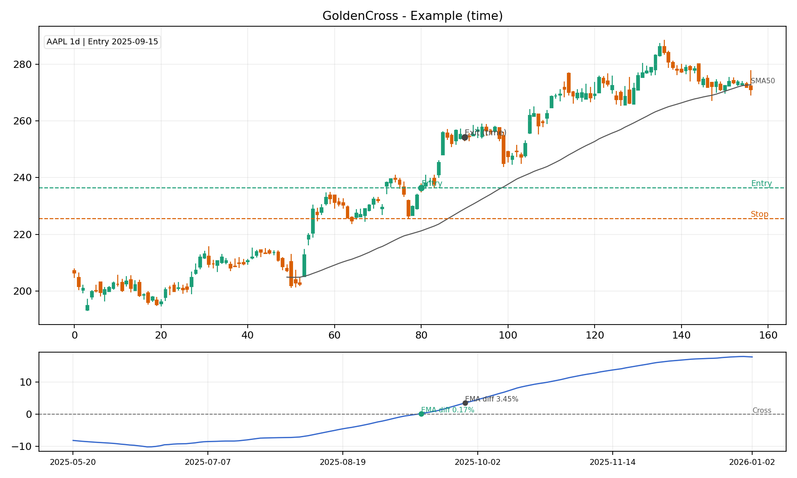

### SupertrendReversal
- **Purpose**: Trend reversal entry using Supertrend flips.
- **Behavior And Rationale**: Supertrend direction changes often align with fresh trend impulses.
- **Entry**: Supertrend flips from -1 to +1 (length=10, multiplier=3).
- **Stop loss**: Supertrend line (SUPERT_10_3.0).
- **Take profit**: none.
- **Exit**: no exit_signal.
- **Example data**: SPY 1d (entry 2026-01-02, fallback)
- **Strategy Parameters**: none (uses common parameters only).
- **Image (example)**: 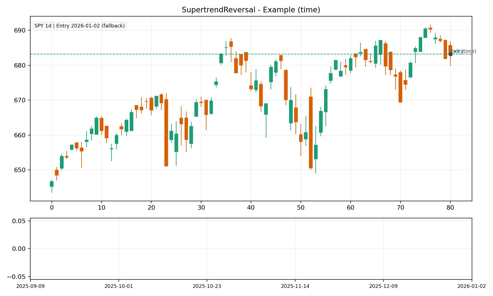

### CloseAboveEma20
- **Purpose**: Short-term trend reclaim entry.
- **Behavior And Rationale**: Regaining EMA20 often signals short-term trend reversal or continuation.
- **Entry**: close above EMA20; if `require_cross` is true then cross from below is required; supports `consecutive_closes` > 1; optional SMA200 filter and EMA slope filter.
- **Stop loss**: default ATR(14) stop (stop_multiplier = 2.0).
- **Take profit**: none.
- **Exit**: no exit_signal.
- **Example data**: AAPL 1d (entry 2025-11-21, signal)
- **Strategy Parameters**:
```text
consecutive_closes (default: 1): Number of consecutive closes required for signal confirmation.
ema_length (default: 20): EMA length used for signal/filters.
require_cross (default: true): Require a fresh cross (vs state) for the EMA signal.
require_sma200 (default: false): Require price above SMA200 for EMA reclaim strategies.
slope_lookback (default: 0): Lookback window for EMA slope calculation.
slope_min (default: 0.0): Minimum EMA slope required.
```
- **Image (example)**: 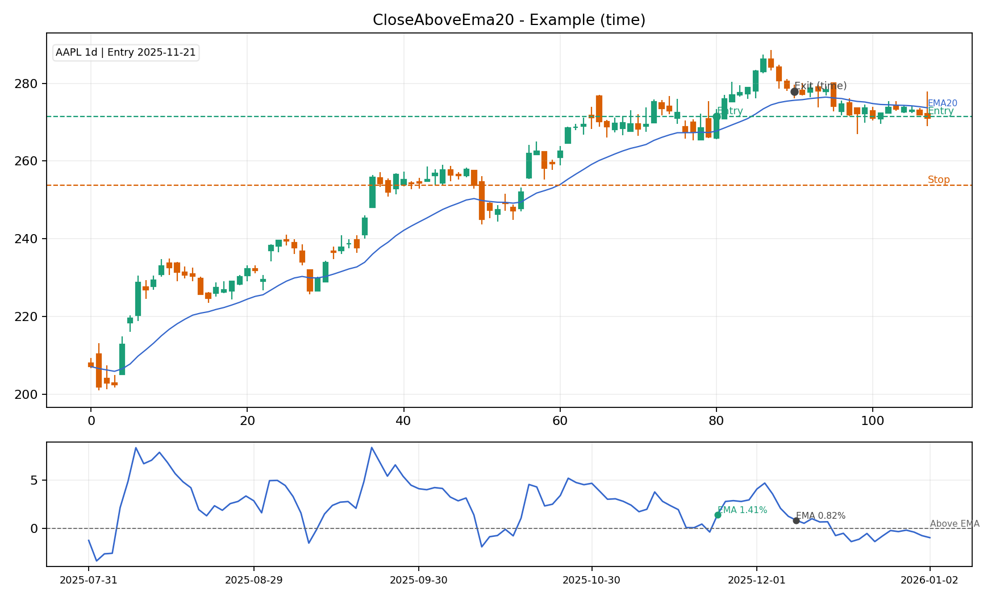

### CloseAboveEma50
- **Purpose**: Intermediate trend reclaim entry.
- **Behavior And Rationale**: EMA50 reclaim often confirms broader trend strength beyond short-term noise.
- **Entry**: same as CloseAboveEma20 but EMA50 is used.
- **Stop loss**: default ATR(14) stop (stop_multiplier = 2.0).
- **Take profit**: none.
- **Exit**: no exit_signal.
- **Example data**: AAPL 1d (entry 2025-08-06, signal)
- **Strategy Parameters**:
```text
ema_length (default: 50): EMA length used for signal/filters.
```
- **Image (example)**: 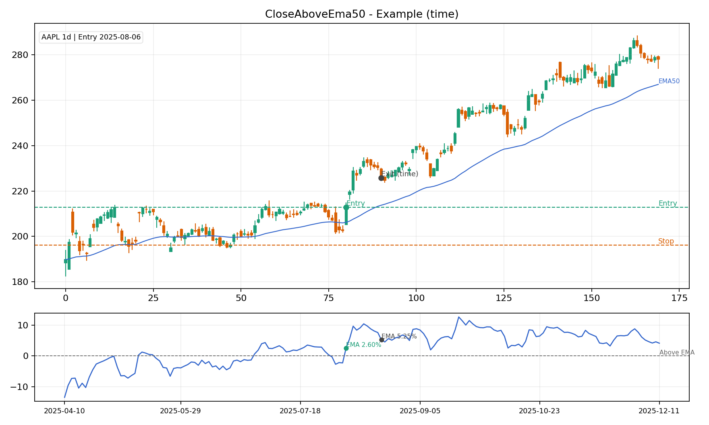

### AboveEmaState20
- **Purpose**: Trend state filter based on EMA20.
- **Behavior And Rationale**: Staying above EMA20 indicates persistent short-term trend health.
- **Entry**: close above EMA20 state; no cross required (`require_cross = False`).
- **Stop loss**: default ATR(14) stop.
- **Take profit**: none.
- **Exit**: no exit_signal.
- **Example data**: AAPL 1d (entry 2025-12-12, signal)
- **Strategy Parameters**:
```text
ema_length (default: 20): EMA length used for signal/filters.
require_cross (default: false): Require a fresh cross (vs state) for the EMA signal.
```
- **Image (example)**: 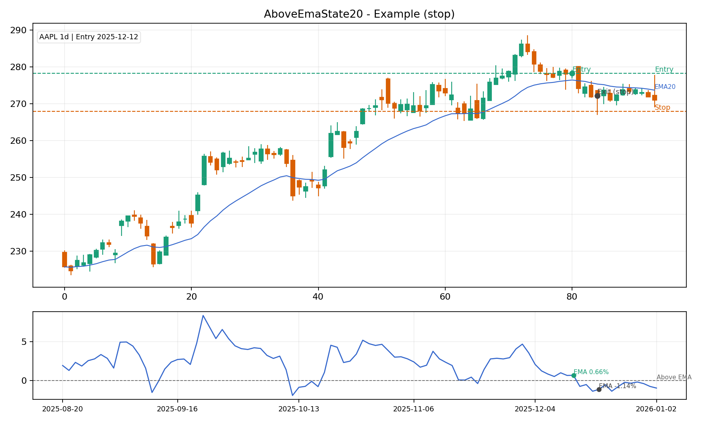

### AboveEmaState50
- **Purpose**: Trend state filter based on EMA50 slope.
- **Behavior And Rationale**: Sustained price above a rising EMA50 reduces whipsaws in choppy periods.
- **Entry**: close above EMA50 state with EMA50 rising (slope_lookback = 1).
- **Stop loss**: default ATR(14) stop.
- **Take profit**: none.
- **Exit**: no exit_signal.
- **Example data**: AAPL 1d (entry 2026-01-02, signal)
- **Strategy Parameters**:
```text
ema_length (default: 50): EMA length used for signal/filters.
require_cross (default: false): Require a fresh cross (vs state) for the EMA signal.
slope_lookback (default: 1): Lookback window for EMA slope calculation.
slope_min (default: 0.0): Minimum EMA slope required.
```
- **Image (example)**: 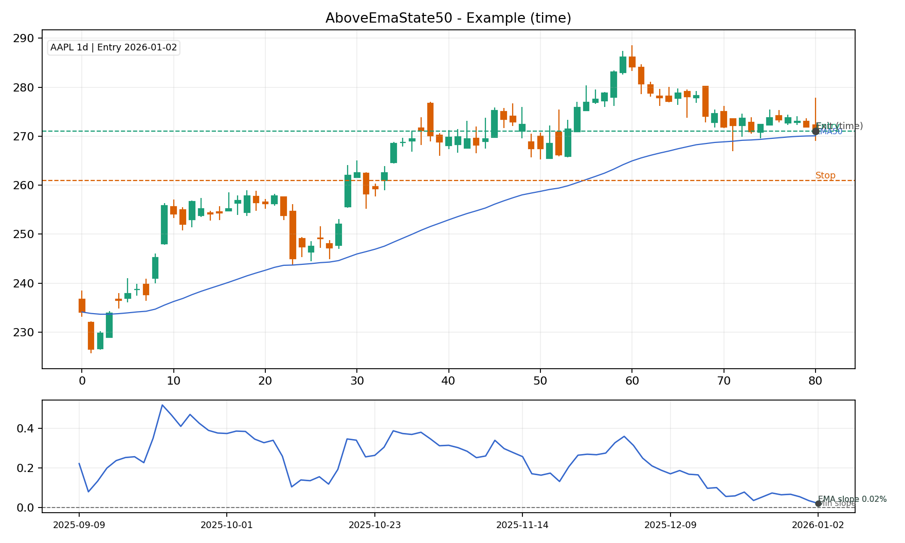

### RelativeStrengthLeader
- **Purpose**: Selects relative-strength leaders for trend portfolios.
- **Behavior And Rationale**: Leaders tend to keep leading, especially in risk-on markets.
- **Entry**: `RS_RANK_{lookback}` >= min_rank_percentile (0.8 default) and `RS_REL_{lookback}` >= min_relative_return_pct (0 default). Requires RS columns in data.
- **Stop loss**: default ATR(14) stop.
- **Take profit**: none.
- **Exit**: no exit_signal.
- **Example data**: AAPL 1d (entry 2025-12-31, signal)
- **Strategy Parameters**:
```text
benchmark_symbol (default: 'SPY'): Benchmark symbol used for relative strength comparisons.
lookback_days (default: 126): Lookback window (days) for relative strength calculations.
min_rank_percentile (default: 0.8): Minimum relative strength rank (percentile).
min_relative_return_pct (default: 0.0): Minimum relative return vs benchmark.
requires_benchmark (default: true): Requires benchmark data for relative strength columns.
```
- **Image (example)**: 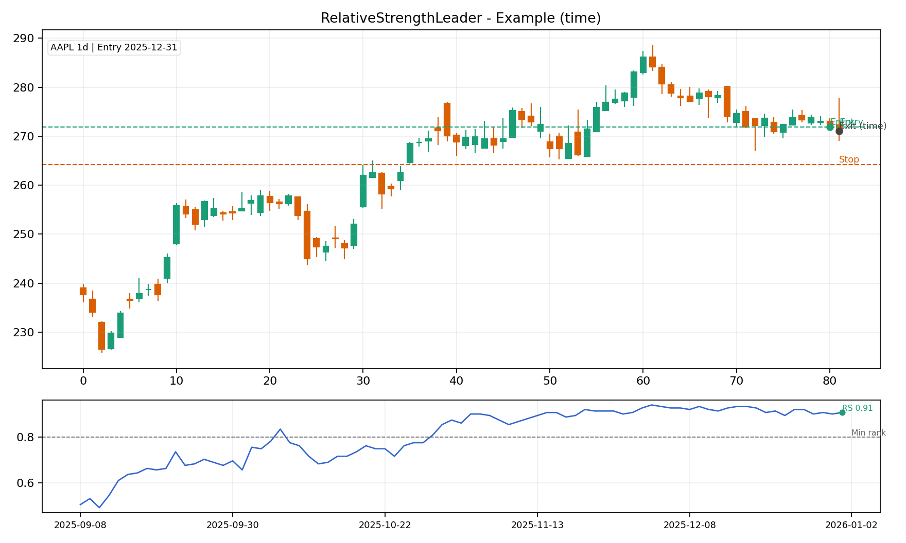

### TrendGate
- **Purpose**: Composite trend filter combining price and relative strength.
- **Behavior And Rationale**: Combining EMA trend and RS rank filters improves signal quality and reduces sideways exposure.
- **Entry**: close > EMA50; EMA50 slope positive over 20 bars; `RS_RANK_{lookback}` >= 0.65 and `RS_REL_{lookback}` >= 0.0.
- **Stop loss**: default ATR(14) stop.
- **Take profit**: none.
- **Exit**: no exit_signal.
- **Example data**: AAPL 1d (entry 2025-12-31, signal)
- **Strategy Parameters**:
```text
benchmark_symbol (default: 'SPY'): Benchmark symbol used for relative strength comparisons.
ema_length (default: 50): EMA length used for signal/filters.
lookback_days (default: 126): Lookback window (days) for relative strength calculations.
min_rank_percentile (default: 0.65): Minimum relative strength rank (percentile).
min_relative_return_pct (default: 0.0): Minimum relative return vs benchmark.
requires_benchmark (default: true): Requires benchmark data for relative strength columns.
slope_lookback (default: 20): Lookback window for EMA slope calculation.
slope_min (default: 0.0): Minimum EMA slope required.
```
- **Image (example)**: 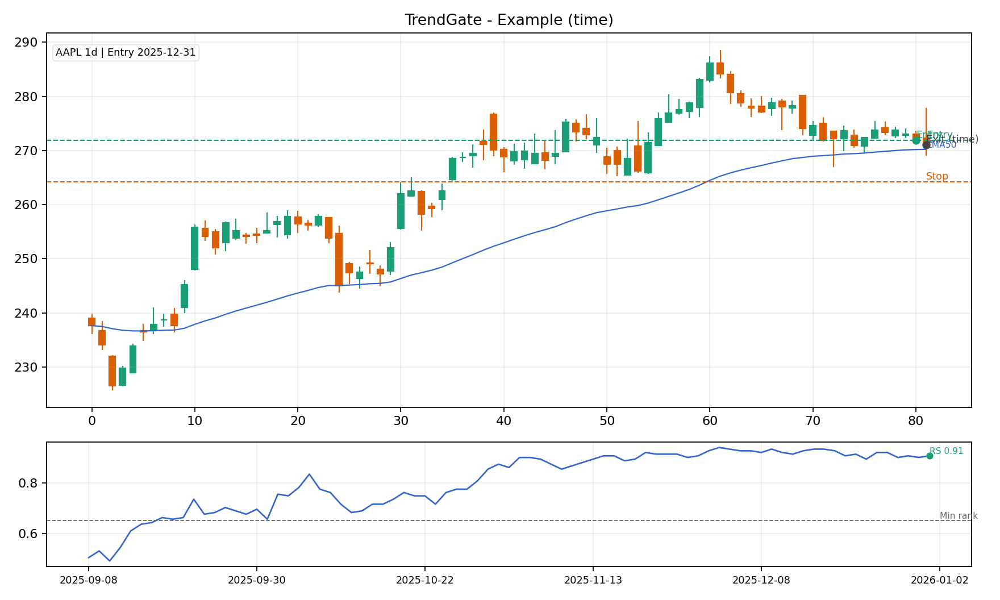

### TrendMaturity
- **Purpose**: Filters for established trends with sufficient duration.
- **Behavior And Rationale**: Longer trend persistence tends to reduce false starts and improve follow-through.
- **Entry**: close above EMA50 for at least 10 bars and EMA slope >= 0.05% over that window.
- **Stop loss**: default ATR(14) stop.
- **Take profit**: none.
- **Exit**: no exit_signal.
- **Example data**: AAPL 1d (entry 2026-01-02, signal)
- **Strategy Parameters**:
```text
ema_length (default: 50): EMA length used for signal/filters.
min_bars_above_ema (default: 10): Minimum consecutive bars above EMA for trend maturity.
min_ema_slope_pct (default: 0.05): Minimum EMA slope percent for trend maturity.
```
- **Image (example)**: 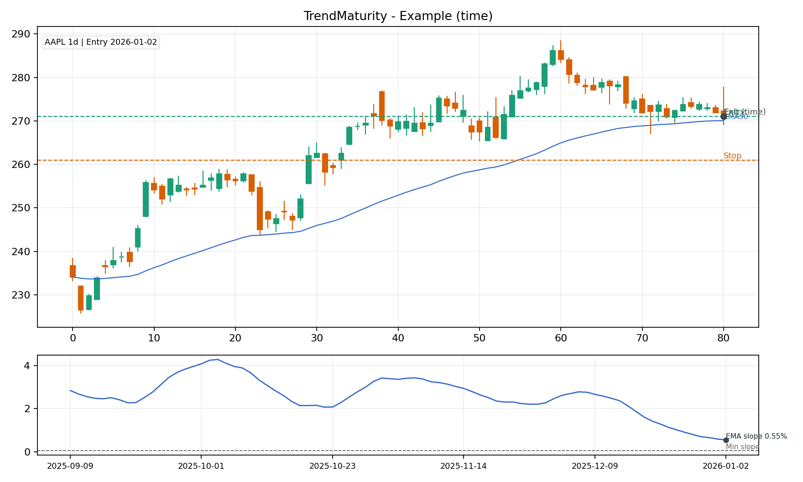

### NoMansLandFilter
- **Purpose**: Avoids low-volatility chop between EMAs.
- **Behavior And Rationale**: EMA compression and low ATR often lead to whipsaws; avoiding these zones improves trade quality.
- **Entry**: ATR% >= 0.8; if `block_if_between_emas` is true then close must not be between EMA20 and EMA50. Intended as a filter.
- **Stop loss**: default ATR(14) stop.
- **Take profit**: none.
- **Exit**: no exit_signal.
- **Example data**: AAPL 1d (entry 2025-12-12, signal)
- **Strategy Parameters**:
```text
block_if_between_emas (default: true): If true, block signals when price is between EMA fast/slow.
ema_fast (default: 20): Fast EMA length used in filters.
ema_slow (default: 50): Slow EMA length used in filters.
min_atr_pct (default: 0.8): Minimum ATR% required for valid signal.
```
- **Image (example)**: 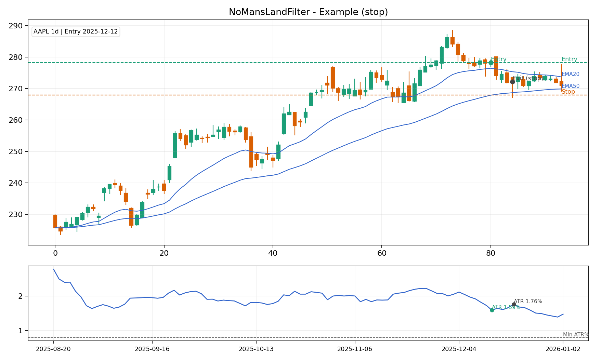

### PullbackToEma
- **Purpose**: Buy pullbacks inside strong uptrends.
- **Behavior And Rationale**: Shallow pullbacks to EMA20 in strong trends often attract dip buyers and resume trend.
- **Entry**: close > EMA200 and EMA200 rising; optional SMA200 and EMA50 trend filters; pullback where low <= EMA20 * 1.005 and close >= EMA20 * 0.995; optional min/max pullback distance (pct or ATR) and optional ATR% filter.
- **Stop loss**: EMA20 - ATR(14) * 0.5 (or EMA20 if ATR unavailable).
- **Take profit**: ATR(14) * 3 above entry.
- **Exit**: RSI crosses above 65; time stop = 15 days.
- **Example data**: AAPL 1d (entry 2025-12-30, signal)
- **Strategy Parameters**:
```text
max_pullback_dist_atr (default: None): Maximum EMA pullback distance in ATR multiples.
max_pullback_dist_pct (default: None): Maximum EMA pullback distance in percent.
min_atr_pct (default: 0.0): Minimum ATR% required for valid signal.
min_pullback_dist_atr (default: None): Minimum EMA pullback distance in ATR multiples.
min_pullback_dist_pct (default: 0.0): Minimum EMA pullback distance in percent.
require_ema50_trend (default: false): Require EMA20 > EMA50 and EMA50 rising.
require_sma200_trend (default: false): Require SMA200 trend filter (price above + rising).
```
- **Image (example)**: 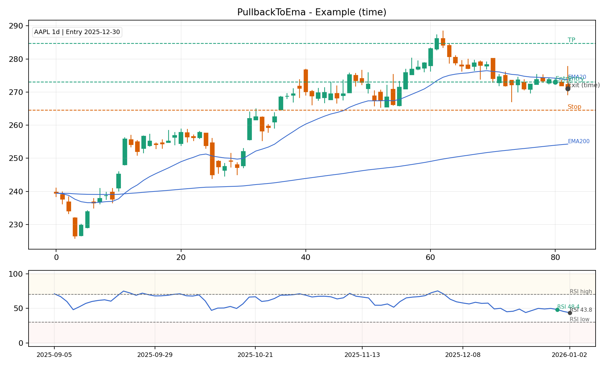

### DonchianBreakout
- **Purpose**: Breakout entry above prior range highs.
- **Behavior And Rationale**: Donchian highs capture new trend breakouts that can persist.
- **Entry**: close > prior N-bar high (`donchian_lookback` default 55) with optional ATR buffer; optional ATR% floor.
- **Stop loss**: Donchian low over `stop_lookback` (default 20) or ATR-based if stop_mode = `atr`.
- **Take profit**: none.
- **Exit**: no exit_signal.
- **Example data**: AAPL 1d (entry 2025-12-02, signal)
- **Strategy Parameters**:
```text
atr_lookback (default: 14): ATR length (bars) used for stop/validation in this strategy.
atr_stop_mult (default: 2.0): ATR multiple used for the ATR-based stop component.
donchian_buffer_atr (default: 0.0): ATR buffer applied around Donchian levels.
donchian_lookback (default: 55): Lookback window for Donchian channel highs/lows.
min_atr_pct (default: 0.0): Minimum ATR% required for valid signal.
stop_lookback (default: 20): Lookback window for structure-based stop anchor.
stop_mode (default: 'donchian_low'): Stop selection mode (e.g., tightest, atr_first, structure_first).
```
- **Image (example)**: 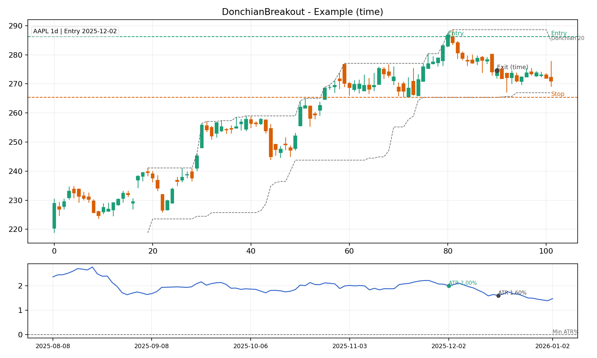

## Structure Strategies (`src/stock_screener/strategies/structure.py`)
### HeadAndShouldersReversal
- **Purpose**: Classic reversal pattern with neckline break and retest.
- **Behavior And Rationale**: A head-and-shoulders pattern reflects trend exhaustion; neckline breaks often lead to measured declines.
- **Entry**: within 120 bars, detect three pivot highs (left shoulder, head, right shoulder) where head is at least 3% above shoulders and shoulders are within 8%; neckline is drawn between the two troughs; price breaks below neckline by 0.2% with volume ratio >= 1.5, then retests within 8 bars with high near neckline and close below it.
- **Stop loss**: above right shoulder + ATR(14) * 0.1.
- **Take profit**: measured move = neckline - (head - neckline at head).
- **Exit**: no exit_signal.
- **Example data**: AAPL 1d (entry 2024-08-12, signal)
- **Strategy Parameters**:
```text
break_buffer_pct (default: 0.002): Percent buffer beyond a level required to confirm a break.
head_to_shoulder_min_pct (default: 0.03): Minimum percent head > shoulders in head-and-shoulders.
lookback (default: 120): Lookback window (bars) used for pattern scanning.
pivot_left (default: 3): Bars to the left required for a pivot high/low.
pivot_right (default: 3): Bars to the right required for a pivot high/low.
retest_tolerance_pct (default: 0.003): Percent tolerance around neckline for retest.
retest_window (default: 8): Bars allowed between break and retest.
shoulder_buffer_atr (default: 0.1): ATR buffer above shoulder for stop placement.
shoulder_tolerance_pct (default: 0.08): Max percent difference between shoulders.
volume_break_ratio (default: 1.5): Minimum volume ratio vs average to confirm break.
volume_lookback (default: 20): Lookback window for average volume.
```
- **Image (example)**: 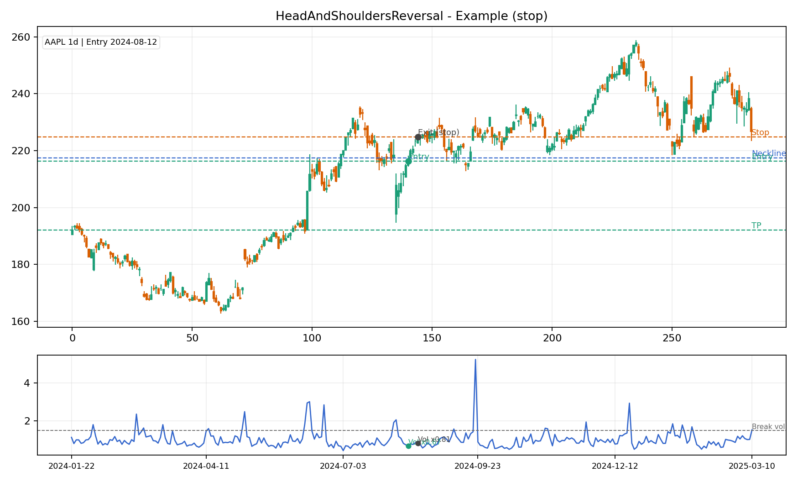

### DoubleTopRsiDivergence
- **Purpose**: Bearish reversal pattern with RSI divergence confirmation.
- **Behavior And Rationale**: A double top with weakening RSI often marks buyer exhaustion and reversal risk.
- **Entry**: within 90 bars, two pivot highs within 3% tolerance; neckline is the min low between peaks; close breaks below neckline by 0.2% with volume ratio >= 1.5; RSI divergence requires second peak RSI at least 3 points lower than the first.
- **Stop loss**: above second peak + ATR(14) * 0.1.
- **Take profit**: measured move = neckline - (peak - neckline).
- **Exit**: no exit_signal.
- **Example data**: AAPL 1d (entry 2023-08-07, signal)
- **Strategy Parameters**:
```text
break_buffer_pct (default: 0.002): Percent buffer beyond a level required to confirm a break.
lookback (default: 90): Lookback window (bars) used for pattern scanning.
peak_buffer_atr (default: 0.1): ATR buffer above peak for stop placement.
peak_tolerance_pct (default: 0.03): Percent tolerance when matching double-top peaks.
pivot_left (default: 3): Bars to the left required for a pivot high/low.
pivot_right (default: 3): Bars to the right required for a pivot high/low.
rsi_divergence_min (default: 3.0): Minimum RSI divergence between pivots.
rsi_length (default: 14): RSI lookback length.
volume_break_ratio (default: 1.5): Minimum volume ratio vs average to confirm break.
volume_lookback (default: 20): Lookback window for average volume.
```
- **Image (example)**: 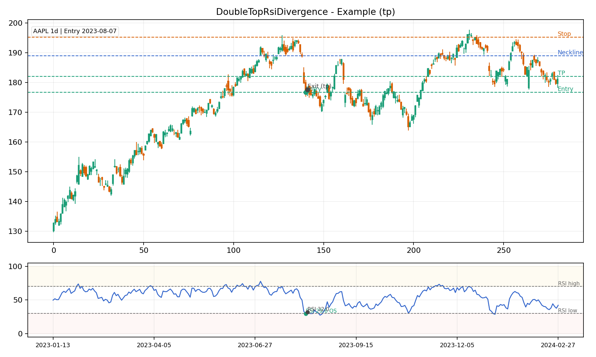

### DoubleBottomRsiDivergence
- **Purpose**: Bullish reversal pattern with RSI divergence confirmation.
- **Behavior And Rationale**: A double bottom with strengthening RSI often marks seller exhaustion and reversal potential.
- **Entry**: within 90 bars, two pivot lows within 3% tolerance; neckline is the max high between troughs; close breaks above neckline by 0.2% with volume ratio >= 1.5; RSI divergence requires second trough RSI at least 3 points higher than the first.
- **Stop loss**: below second trough - ATR(14) * 0.1.
- **Take profit**: measured move = neckline + (neckline - trough). Full TP is disabled (`use_take_profit = False`) but the target is used for partials (30% at TP).
- **Exit**: trailing enabled from 1.25R; trend confirmation (2 closes within 5 days) activates trend trailing (EMA50); exhaustion exit enabled; add-ons allowed (max 1) after trend confirmation.
- **Example data**: AAPL 1d (entry 2024-01-18, signal)
- **Strategy Parameters**:
```text
break_buffer_pct (default: 0.002): Percent buffer beyond a level required to confirm a break.
lookback (default: 90): Lookback window (bars) used for pattern scanning.
pivot_left (default: 3): Bars to the left required for a pivot high/low.
pivot_right (default: 3): Bars to the right required for a pivot high/low.
rsi_divergence_min (default: 3.0): Minimum RSI divergence between pivots.
rsi_exit_threshold (default: None): RSI level used to trigger exit.
rsi_length (default: 14): RSI lookback length.
trough_buffer_atr (default: 0.1): ATR buffer below trough for stop placement.
trough_tolerance_pct (default: 0.03): Percent tolerance when matching double-bottom troughs.
volume_break_ratio (default: 1.5): Minimum volume ratio vs average to confirm break.
volume_lookback (default: 20): Lookback window for average volume.
```
- **Image (example)**: 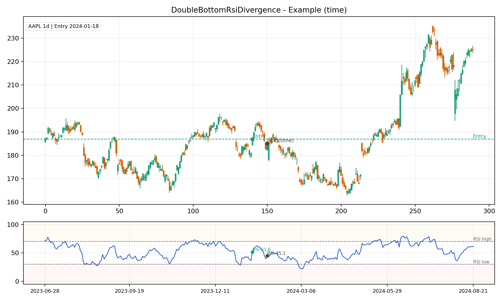

### TriangleBreakout
- **Purpose**: Breakout from a contracting triangle structure.
- **Behavior And Rationale**: As range contracts, breakout direction can expand quickly; volume confirmation helps reduce false breaks.
- **Entry**: last 60 bars form a contracting triangle (upper trendline slope < 0, lower > 0), contraction ratio <= 0.7, volume decays into apex, and price breaks above upper line by 0.2% with volume ratio >= 1.5.
- **Stop loss**: lower trendline - ATR(14) * 0.1.
- **Take profit**: measured move = triangle height added to entry.
- **Exit**: no exit_signal.
- **Example data**: ADBE 1d (entry 2025-05-30, signal)
- **Strategy Parameters**:
```text
break_buffer_pct (default: 0.002): Percent buffer beyond a level required to confirm a break.
contraction_ratio (default: 0.7): Max ratio of end-range to start-range for triangle contraction.
lookback (default: 60): Lookback window (bars) used for pattern scanning.
min_bars (default: 20): Minimum bars required inside pattern window.
stop_buffer_atr (default: 0.1): ATR buffer applied to stop below/above level.
volume_break_ratio (default: 1.5): Minimum volume ratio vs average to confirm break.
volume_decay_ratio (default: 0.8): Required volume decay in consolidation vs early period.
volume_lookback (default: 20): Lookback window for average volume.
```
- **Image (example)**: 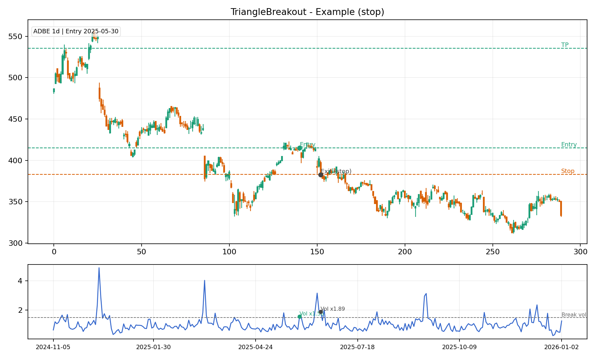

### FlagPennantContinuation
- **Purpose**: Continuation entry after a flag or pennant.
- **Behavior And Rationale**: A strong flagpole followed by a controlled retrace often leads to continuation when the flag breaks.
- **Entry**: flagpole return >= 8% over 12 bars; flag retrace between 38% and 50% over 10 bars; flag volume <= 0.7 * pole volume; breakout above flag high by 0.2% with volume ratio >= 1.5.
- **Stop loss**: flag low - ATR(14) * 0.1.
- **Take profit**: measured move = pole height added to entry.
- **Exit**: no exit_signal.
- **Example data**: SPY 1d (entry 2025-11-20, fallback)
- **Strategy Parameters**:
```text
break_buffer_pct (default: 0.002): Percent buffer beyond a level required to confirm a break.
flag_lookback (default: 10): Bars used to measure the flag consolidation.
flagpole_lookback (default: 12): Bars used to measure the flagpole impulse.
min_flagpole_return (default: 0.08): Minimum flagpole return (percent) for flag patterns.
retrace_max (default: 0.5): Max retrace percentage for flag/pennant.
retrace_min (default: 0.38): Min retrace percentage for flag/pennant.
stop_buffer_atr (default: 0.1): ATR buffer applied to stop below/above level.
volume_break_ratio (default: 1.5): Minimum volume ratio vs average to confirm break.
volume_decay_ratio (default: 0.7): Required volume decay in consolidation vs early period.
volume_lookback (default: 20): Lookback window for average volume.
```
- **Image (example)**: 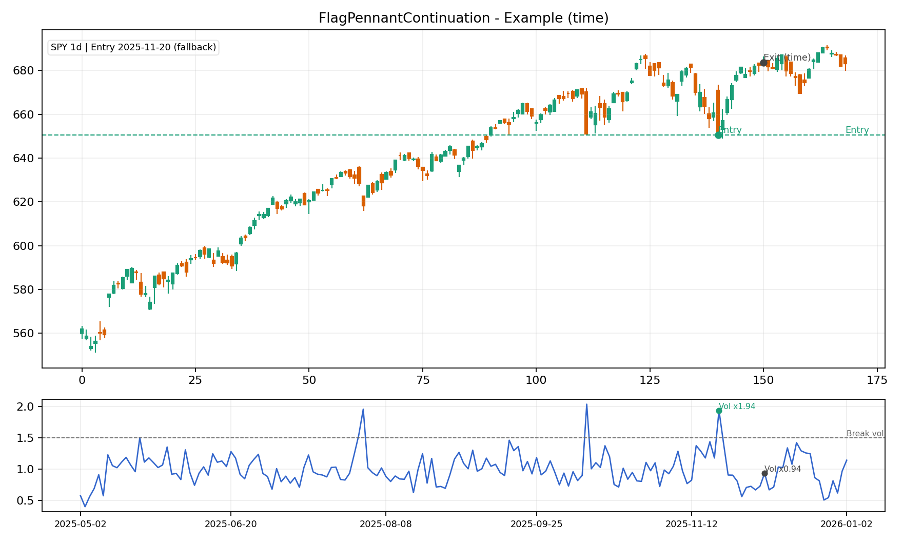

### SupportResistanceBreakRetest
- **Purpose**: Break-and-retest entry from clustered resistance zones.
- **Behavior And Rationale**: Multiple touches at a level build liquidity; a break and retest often signals real demand.
- **Entry**: pivot highs clustered into zones within 0.5% tolerance and at least 3 touches; price breaks above zone by 0.2% with volume ratio >= 1.5, then retests within 8 bars where low <= zone_high and close >= zone_high.
- **Stop loss**: zone_low (center * (1 - tolerance)).
- **Take profit**: next higher zone if available.
- **Exit**: no exit_signal.
- **Example data**: AAPL 1d (entry 2025-02-12, signal)
- **Strategy Parameters**:
```text
break_buffer_pct (default: 0.002): Percent buffer beyond a level required to confirm a break.
lookback (default: 120): Lookback window (bars) used for pattern scanning.
min_touches (default: 3): Minimum number of touches to form a valid zone.
pivot_left (default: 3): Bars to the left required for a pivot high/low.
pivot_right (default: 3): Bars to the right required for a pivot high/low.
retest_window (default: 8): Bars allowed between break and retest.
volume_break_ratio (default: 1.5): Minimum volume ratio vs average to confirm break.
volume_lookback (default: 20): Lookback window for average volume.
zone_tolerance_pct (default: 0.005): Percent tolerance used to cluster levels into zones.
```
- **Image (example)**: 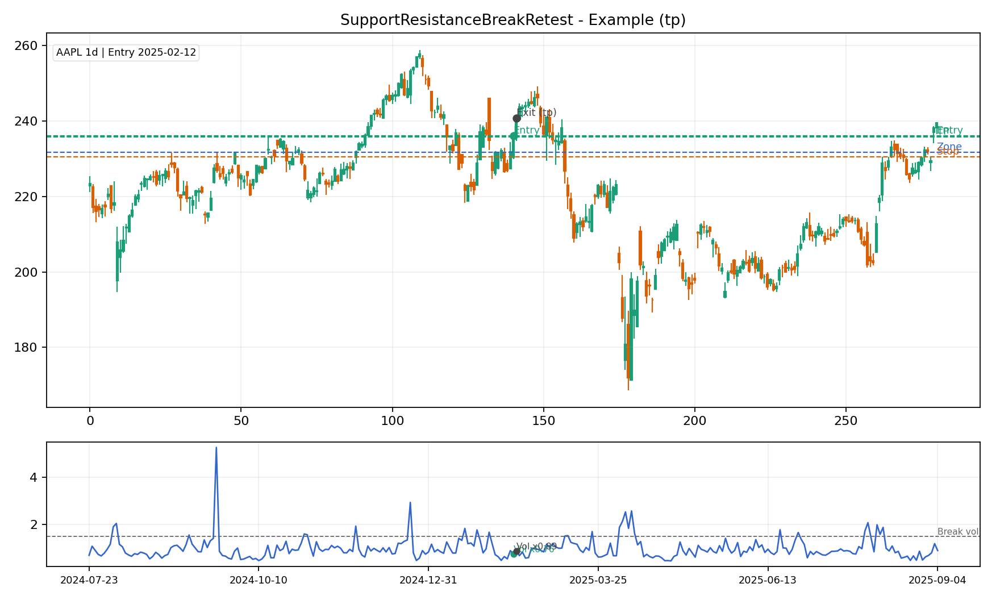

### LongTermSupportResistanceBreakRetest
- **Purpose**: Weekly structure break with daily retest execution.
- **Behavior And Rationale**: Long-term levels attract institutional order flow; breaks with retests often lead to durable moves.
- **Entry**: weekly pivot highs over ~130 weeks clustered into zones (min touches 2). A daily close breaks above the zone by 0.2%, the setup is armed, and a retest within 10 days confirms with close(s) above zone high. Armed setups expire after 30 days or invalidate on a close below the level. Optional risk-on requirement is enforced when enabled.
- **Stop loss**: zone_low - ATR(14) * 1.0 with a max stop distance of 3 ATR; entry rejected if stop exceeds max.
- **Take profit**: next higher zone if available.
- **Exit**: time stop = 25 days.
- **Example data**: AIG 1d (entry 2025-04-22, signal)
- **Strategy Parameters**:
```text
arm_across_regime (default: false): If true, keep armed break setups across regime changes.
arm_expiry_days (default: 30): Max days an armed break can remain valid before expiring.
arm_invalidate_buffer_pct (default: 0.001): Percent buffer below armed level that invalidates a pending setup.
arm_invalidate_on_close_below_level (default: true): If true, invalidate armed setup when close falls below level.
arm_record_break_metrics (default: true): If true, record extra metrics about the break when arming.
arm_requires_risk_on_entry (default: true): Require risk-on regime at the retest entry.
break_buffer_pct (default: 0.002): Percent buffer beyond a level required to confirm a break.
break_confirm_closes (default: 1): Consecutive closes required beyond the break level.
cluster_atr_mult (default: 0.8): ATR multiple used when clustering levels into zones.
levels_lookback_weeks (default: 130): Weekly lookback window for level construction.
levels_shift (default: 1): Shift used when aligning weekly levels to daily bars.
levels_timeframe (default: '1w'): Timeframe for long-term level detection (e.g., 1w).
max_levels (default: 12): Maximum number of zones/levels retained after clustering.
max_stop_atr (default: 3.0): Maximum stop distance in ATR multiples before rejecting.
min_level_distance_atr (default: 1.5): Minimum distance between zones in ATR multiples.
min_touches (default: 2): Minimum number of touches to form a valid zone.
pivot_left (default: 3): Bars to the left required for a pivot high/low.
pivot_right (default: 3): Bars to the right required for a pivot high/low.
retest_confirm_closes (default: 1): Consecutive closes required on retest.
retest_max_days (default: 10): Max days allowed between break and retest.
stop_atr_mult (default: 1.0): ATR multiple added to stop placement.
volume_break_ratio (default: 0.0): Minimum volume ratio vs average to confirm break.
volume_lookback (default: 20): Lookback window for average volume.
zone_tolerance_pct (default: 0.005): Percent tolerance used to cluster levels into zones.
```
- **Image (example)**: 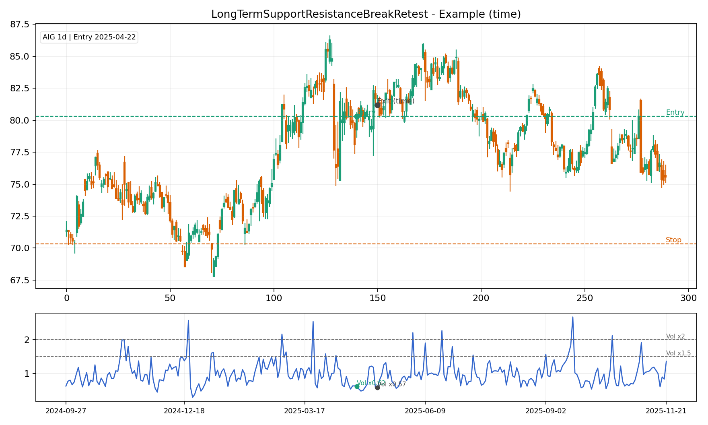

### MarketAlignedStructureBreak
- **Purpose**: Structure break-and-retest with market regime alignment.
- **Behavior And Rationale**: Combining level breaks, trend state, and market regime reduces false breakouts and improves follow-through.
- **Entry**: daily structure level from pivot highs (min touches 2). Close breaks above zone by 0.1% with volume ratio >= 1.0 to arm the setup. Retest within 10 days must tag the zone band and print a bullish reversal candle (hammer or bullish engulfing), then the next bar must close higher. Market filter `MKT_RISK_ON_FOR_LONGS` must be true; trend up state and EMA10 > EMA20 > EMA50 are required.
- **Stop loss**: below retest low or at least 1.5% under entry, capped at 2.5%.
- **Take profit**: next zone or fib extension (1.272/1.618) from swing low; must satisfy min room (>= 2%) and RR >= 2.
- **Exit**: no exit_signal (stop/TP only).
- **Example data**: ARE 1d (entry 2019-09-12, signal)
- **Strategy Parameters**:
```text
break_buffer_pct (default: 0.001): Percent buffer beyond a level required to confirm a break.
break_confirm_closes (default: 1): Consecutive closes required beyond the break level.
debug_counters (default: false): Enable internal counter logging for strategy diagnostics.
debug_rr_samples_max (default: 50): Max debug samples recorded for risk/reward diagnostics.
ema_fast (default: 10): Fast EMA length used in filters.
ema_mid (default: 20): Mid EMA length used in filters.
ema_slow (default: 50): Slow EMA length used in filters.
fib_extensions (default: [1.272, 1.618]): Fib extensions used for target selection in structure breaks.
fib_lookback (default: 120): Lookback window for swing high/low when building fib targets.
fib_min_swing_pct (default: 0.02): Minimum swing size (percent) for fib-based targets.
lookback (default: 180): Lookback window (bars) used for pattern scanning.
max_levels (default: 12): Maximum number of zones/levels retained after clustering.
min_room_pct (default: 0.02): Minimum room to target (percent) for structure break.
min_rr (default: 2.0): Minimum risk/reward required to take a trade.
min_touches (default: 2): Minimum number of touches to form a valid zone.
pivot_left (default: 3): Bars to the left required for a pivot high/low.
pivot_right (default: 3): Bars to the right required for a pivot high/low.
prefer_fib_if_rr_better (default: false): Prefer fib target when it improves risk/reward.
retest_band_atr (default: 0.0): ATR band size around level used for retest validation.
retest_confirm_closes (default: 1): Consecutive closes required on retest.
retest_max_days (default: 10): Max days allowed between break and retest.
stop_max_pct (default: 0.025): Maximum stop distance as percent of entry.
stop_min_pct (default: 0.015): Minimum stop distance as percent of entry.
target_buffer_pct (default: 0.0): Buffer applied to target levels.
trend_pivot_left (default: 2): Left pivot width for trend state detection.
trend_pivot_right (default: 2): Right pivot width for trend state detection.
volume_break_ratio (default: 1.0): Minimum volume ratio vs average to confirm break.
volume_lookback (default: 20): Lookback window for average volume.
volume_retest_max_ratio (default: 1.0): Max volume ratio allowed on retest.
zone_tolerance_pct (default: 0.005): Percent tolerance used to cluster levels into zones.
```
- **Image (example)**: 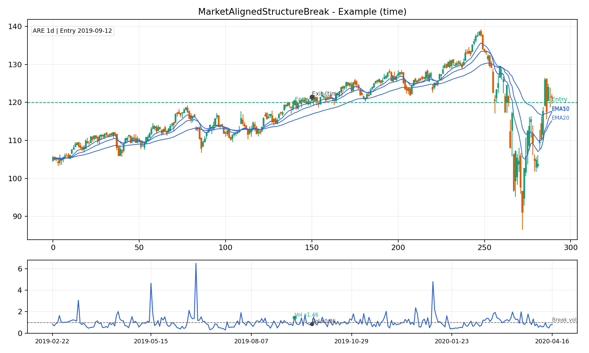
